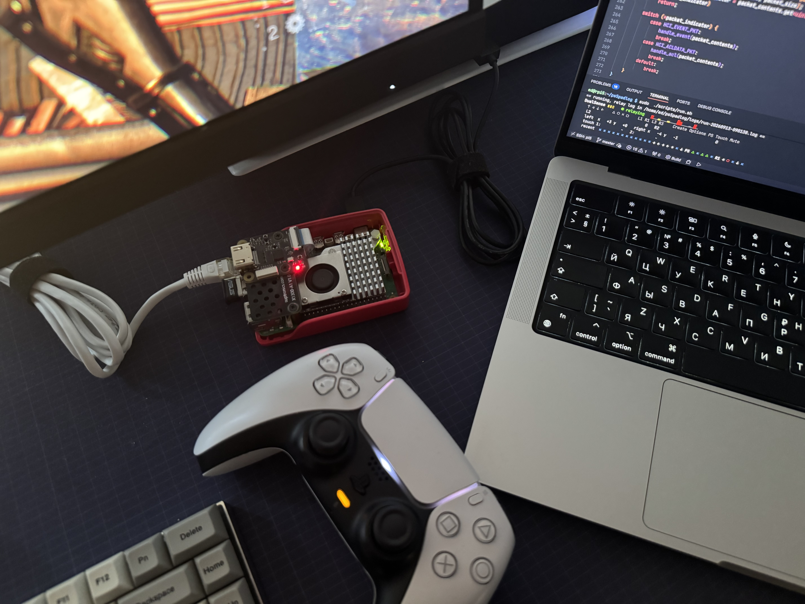

# ps5padlog

A Raspberry Pi 5 that sits between a DualSense and a PS5, relays everything in
both directions - input, rumble, lightbar, trigger effects - and shows every
button, stick and touch as it goes past, with each press written to a log.

    DualSense --BT--> [USB BT dongle]  Raspberry Pi 5  [onboard radio] --BT--> PS5
                                          |
                                        USB-C --> PS5   (registration only)

To the console it is a controller; to the pad, the Pi is its host. Apart from
one PS press during registration (see below), nothing that passes through is
changed.

Getting there took a lot of packet captures. Most of what follows is what those
captures showed, because nearly every part of the design exists to get past
something specific the console does. `PROTOCOL.md` is the wire itself — the
report formats, the two checksums, the second stream hidden in the input
channel, and the authentication handshake.

## How it works

You can't simply pair the pad to a Bluetooth adapter and relay it to the
console. A PS5 only accepts a controller over Bluetooth once it has registered
that controller over USB, it talks to the controller from a different radio
than the one it registered it on, and it only answers a controller address it
already trusts. So the Pi has three jobs: be a DualSense on the USB-C port for
registration, hold the real pad on one radio, and be that same pad - down to
its Bluetooth address - on the other.

This is what happens on every run:

1. **The pad connects to the pad-facing dongle.** Press PS to wake it; the
   two use the link key saved when they were first paired.
2. **The Pi shows up on USB-C as a DualSense.** The console reads the feature
   reports a controller has - calibration, firmware info, the host table - and
   every one of those requests is answered by the real pad over Bluetooth. Then
   it writes its own Bluetooth address and a link key into report `0x0a` and
   sends `0x08 = 0x02`.
3. **The console waits for the PS button.** It sends `0x08 = 0x01` ("come to
   me over Bluetooth") only after it sees PS pressed in the reports arriving
   over USB, answering about 8 ms after the press. A press in roughly the first
   second after input starts flowing is ignored - one at 211 ms did nothing, one
   at 1002 ms worked. So the relay presses PS itself a second in, and again
   every 1.5 s until the console answers. That is the only thing it ever adds
   to the stream.
4. **The USB gadget detaches at once.** While the same controller is still on
   its USB port, the console refuses a Bluetooth connection with *limited
   resources*. A real pad is unplugged at this point, so this one is too.
5. **The console-facing radio calls the console.** It already answers to the
   pad's own address, so the console meets a controller it knows. It
   authenticates with the key the console just wrote, encrypts, lets the
   console take the master role, and passes the console's SDP query to the real
   pad.
6. **The console opens both HID channels, then calls back from its second
   radio.** A PS5 has two Bluetooth addresses one apart (`...:AA` and `...:AB`
   here), and play happens on the call-back link. The first link stays open:
   drop it and the console drops both.

From then on the pad's reports go to the console and the console's go to the
pad, byte for byte, until you press Ctrl+C.

### Feature reports seen during registration

| report | direction | what it is |
| --- | --- | --- |
| `0x05` | console reads | IMU calibration |
| `0x09` | console reads | pad address, class of device, current host address |
| `0x0b` | console reads | pad address and a ranked table of its recent hosts |
| `0x20` | console reads | firmware and build date |
| `0x0a` | console writes | console Bluetooth address + 16-byte link key |
| `0x08` | console writes | `0x02` unpair, `0x01` pair over Bluetooth |
| `0x80` / `0x81` | write / read | a command channel; `01 13` returns the serial |

Over Bluetooth a feature report is always its full declared size with a CRC32
in the last four bytes, seeded with the HIDP header byte. Over USB there is no
checksum and the console asks for exactly the size it wants.

### Things that turned out to matter

**Address spoofing needs the right chip.** The console-facing radio has to take
over the pad's Bluetooth address. Broadcom and Cypress parts do this with
vendor command `0xfc01`; Realtek parts can't, and the kernel has no
`set_bdaddr` for them. The Pi 5's onboard BCM4345C0 can, and it runs the console
side here. On the play link it managed a median of 7.8 ms between reports at
about 189 per second, a little better than an ASUS BT400 in the same role.

**Nobody does flow control unless you do.** The relay drives both adapters
through `HCI_CHANNEL_USER`, where the kernel meters nothing. These controllers
have 6-8 ACL buffers, and early versions pushed a report out with every
`write()`, which queued thousands of packets behind a link that carries about a
hundred a second. It looked like half a dozen unrelated bugs: twenty
seconds to bring up a link that normally takes 180 ms, LMP transaction
collisions, and input that arrived seconds late. The relay now counts
outstanding packets and drops an input report rather than queueing it. It
keeps two in the controller at most, because a newer report is always a
millisecond or two behind.

**Start with the short report.** Like a real pad, the relay sends the console
the cut-down 10-byte `0x01` input report until the console asks for calibration
or firmware info, and only then switches to the full `0x31`. Starting on `0x31`
gets "this device isn't supported".

**Send the SDP record in one piece.** The pad's record is about 685 bytes.
Split across the default 185-byte MTU, the console stalled on the HID channel
and never asked for the rest.

**Give the radio back after the call-back.** Page scan has to be eager until
the console has called from its second radio, or the call-back is missed. Left
that way it cost half the radio's time on the play link: 395 transmit stalls of
over 50 ms in 96 seconds. Returned to the standard window once play starts, it
was 16.

**Links outlive the process.** On a user channel the kernel doesn't reset the
controller when the program exits, so a killed relay leaves live links in the
radio's firmware, and the next run inherits them. Stop it with Ctrl+C; SIGTERM
and SIGHUP are handled the same way. A link the current run didn't open gets
closed on its first packet anyway.

**Not everything on report 0x31 is input.** Once the console owns the pad,
about one report in six is a second, fixed-rate stream that shares report id
`0x31`, told apart by bit 0 of the flags byte. It is not relayed to the
console, which leaves the credits for input.

**The report descriptor is 289 bytes.** The 273-byte version that circulates
online is missing feature reports `0x0b` and `0x0c`, and the console stops
asking exactly where the descriptor runs out. This one was read back from a real
pad.

**USB is for registration only.** The console will not play a relayed
controller over the cable; it always asks for the Bluetooth handover.

### The USB gadget

The gadget is built at startup through configfs and matches a real DualSense's
interface layout: three UAC1 audio interfaces from the kernel's `uac1`, and the
HID interface as interface 3. The HID interface is a FunctionFS function served
by the relay itself. FunctionFS hands userspace every control request aimed at
the interface - the report descriptor, GET_REPORT, SET_REPORT - so a console's
GET_REPORT can wait on a Bluetooth round trip to the pad, and a SET_REPORT goes
to the pad as it arrives. The interrupt endpoints are driven through kernel AIO,
so an unpolled endpoint never blocks the relay.

No kernel patch or custom module is involved.

## What you need

### Hardware

- **A Raspberry Pi 5.** Its USB-C port is the only one that can act as a
  device, so that is where the cable to the PS5 goes.
- **A USB Bluetooth dongle for the pad.** Anything works here, since that side
  keeps its own address. I used an ASUS BT500 (Realtek RTL8761B).
- **A radio that accepts an address change for the console side.** The Pi 5's
  onboard radio does, and it's the one to use.

An ASUS BT400 (Broadcom BCM20702A0) also works on the console side, but it needs
`brcm/BCM20702A1-0b05-17cb.hcd` in `/lib/firmware`, which linux-firmware does not
ship. Without it the dongle runs on its factory ROM and dmesg says
`Patch file not found`.

### Software

**Raspberry Pi OS based on Debian 13 (trixie), 64-bit.** Trixie matters because
it's the first Debian with Boost 1.83, which the relay needs for Asio coroutines.
On bookworm CMake won't configure. Tested with kernel 6.6.78.

    sudo apt install \
        build-essential cmake pkgconf \
        libboost-all-dev libbluetooth-dev libusbgx-dev zlib1g-dev \
        bluez bluez-hcidump rfkill python3

`bluez-hcidump` is only for `run.sh --capture`. You don't need it to run the
relay, but when something goes wrong, those captures are where the answer is.

**The kernel needs nothing unusual.** These options have to be enabled, and
Raspberry Pi OS's own kernel has all of them:

| option | used for |
| --- | --- |
| `CONFIG_USB_DWC2` | the USB-C device controller |
| `CONFIG_USB_CONFIGFS` | building the gadget |
| `CONFIG_USB_CONFIGFS_F_FS` | the HID interface (`usb_f_fs`) |
| `CONFIG_USB_CONFIGFS_F_UAC1` | the audio interfaces (`usb_f_uac1`) |
| `CONFIG_AIO` | the HID interrupt endpoints |

## Setup

**1. Let the USB-C port be a device.** In `/boot/firmware/config.txt`, under
`[all]`:

    dtoverlay=dwc2

with no `dr_mode`. If there's a `dtoverlay=dwc2,dr_mode=host` under `[cm5]` or
`otg_mode=1` under `[cm4]`, leave them alone; those sections don't apply to a
plain Pi 5. Reboot, and the device controller should be there:

    $ ls /sys/class/udc
    1000480000.usb

If that directory is empty, the overlay didn't take, and nothing else will work.

**2. Tell it which radio is which.** Adapter numbers change between boots, and
sending console traffic out of the wrong radio fails in ways that look like
protocol bugs. So the adapters are pinned by address in
`/etc/dualsense_mitm.adapters`:

    PAD=08:BF:B8:4C:E1:64
    PS5=D8:3A:DD:9E:8B:F9

`hciconfig` lists the addresses. `PS5=` is the radio that will take on the
pad's address, so it has to be the one that can. If the file is missing,
`run.sh` writes one from the first two USB adapters it finds, which is wrong
when the console side is the onboard radio. Write it by hand.

**3. Put your controller's address into `scripts/run.sh`.** It's the `PAD_MAC`
line. It's only used for the first pairing; after that, the address comes from
the saved key.

**4. Build.**

    cmake -S . -B build -DCMAKE_BUILD_TYPE=Release
    cmake --build build -j4

## Running it

The first time, pair the pad from scratch:

    sudo ./scripts/run.sh --fresh-pairing

and put the pad in pairing mode by holding PS and Create for about three seconds.
After that:

    sudo ./scripts/run.sh

and press PS once to wake the pad, or don't press anything if it's already
awake. Leave it alone from there; the relay makes the press the console is
waiting for.

Everything beyond that is a flag, and off by default:

| flag | what it adds |
| --- | --- |
| `--fresh-pairing` | forget the pad's link key and pair from scratch (`DS_FRESH_PAIRING=1` still works) |
| `--capture` | an `hcidump` capture of each radio link in `logs/`, for the tools under `tools/` - about 10 MB a minute between them |
| `--diag` | the rates, gaps, effects loss and what the controller says about the radio, on the panel |
| `--debug` | an unoptimised build with debug info, in `build-debug/` |

`run.sh` builds anything that changed - optimised, `-O2`, in its own
`build-release/`, so an editor reconfiguring `build/` cannot change what runs -
stops and masks the `bluetooth` service (the relay has to own both adapters
outright; unmask the service when you want BlueZ back), takes the adapters down,
loads `usb_f_fs` and `usb_f_uac1`, and runs the relay. A healthy run logs roughly
this:

    USB input reports now flowing to PS5!
    pressing PS for the console, attempt 1 at 1002 ms
      -> pair (0x01), relaying to the pad
      -> detaching from USB
    Console HID channels open - relaying the pad to the PS5

and the status line ends up at `console: relaying`.

### Watching the input

The terminal doesn't show the relay's log. It shows the pad's input as a fixed
block redrawn in place: buttons lit while held, trigger travel, sticks, touch,
recent presses and the battery. Every press and release also goes to
`logs/inputs-<stamp>.log`:

    2026-09-11 18:02:00.130  down  L1  L1
    2026-09-11 18:02:00.232  up    L1  L1

The relay's own log is `logs/run-<stamp>.log`. With `--capture` the two
captures sit next to it (`capture-<stamp>.dump` for the pad,
`capture-ps5-<stamp>.dump` for the console). Ctrl+C stops everything together;
stop it that way rather than by closing the terminal.

The viewer is a separate program that needs no privileges. It reads the relay's
`/dev/shm/ds_input`, so you can run `build-release/ps5padlog-view` by hand next to a
running relay, with `--log FILE` for the press log. When stdout isn't a terminal,
it prints the press log instead of the panel.

### Files it keeps

- `/etc/dualsense_mitm.key` holds the pad's link key and address. If the pad
  stops honouring the key, the relay drops it and asks for pairing mode.
  `DS_FRESH_PAIRING=1` deletes it.
- `/etc/dualsense_mitm_console.key` holds the console's address and the link key
  it wrote during registration, plus the controller address, so a key is never
  used with a different pad. Delete it to force a fresh registration.

## When it doesn't work

**The console enumerates the gadget but never reads it.** The first stats line
shows it:

    USB 5s: in ok=1 eagain=3047 ctrl=7      <- stuck
    USB 5s: in ok=89 eagain=402 ctrl=8      <- healthy, pair command follows

The console has done its control transfers and decided not to poll for input,
so it never sees the PS press. The Bluetooth half is fine when you see this -
don't go looking there.

**What was causing it, and why unplugging the dongle fixed it.** The relay
talks to both radios over an HCI user channel, and on a user channel the kernel
skips its own initialisation - reset included. The relay did not reset them
either, so a controller kept whatever the last run left in its firmware. The one
that mattered was a live Bluetooth link to the console: the relay exits, the
console-facing controller keeps the link up, and the console carries on sending
effects to what it still believes is its controller. When the next run brings
the gadget up, the console already has the controller over Bluetooth and has no
reason to poll it over USB.

The log said so, if you knew where to look - near the top of every run that
hung:

    hci1 traffic on handle 13, which this run never opened - a link left behind by a previous one

Across fourteen runs in one evening, five of the six that printed that line hung
at "registering on the PS5", and none of the eight that did not. Unplugging the
dongle worked because unplugging is a reset. The relay now resets both
controllers before sending them anything else, and waits for the controller to
confirm it, so that line should not appear and the unplugging should not be
needed.

An earlier version of this section blamed a leftover USB gadget, on two runs out
of two. It did not hold up: later runs removed a leftover gadget and registered
fine.

If it happens anyway, a full power-down of the console clears it; rest mode
doesn't.

**The pad keeps connecting and dropping.** The disconnects say
`Remote User Terminated Connection`, the links get shorter each time, and then
the pad stops answering pages. That's a flat battery, and from the console's
side it looks exactly like a console that has stopped cooperating. The viewer
shows the pad's battery.

**The pad no longer works with the PS5 on its own.** The pad keeps a table of
three hosts, and every bond to the spoofed address takes a new slot, so after
enough runs the console falls out of it. Pair the pad with the console directly
again.

**Don't charge the pad from the Pi's USB-A ports.** The kernel's `playstation`
driver grabs it, and then two drivers are holding the same controller. A wall
charger is fine. The console is not, because then there's a second controller on
the port the Pi is pretending to be.

**Input stutters while playing - the camera stops, snaps back, then jumps.**
Not the relay, and not a dropped link: a 2.4 hour session has zero reconnections
in it. The console stops taking input for about 135 ms at a time, in runs of
three or so, and it does this sixty times more often while it is streaming
haptic audio to the controller. Turning the controller's haptics and speaker
down on the console is the one lever that is not on the Pi. `PERFORMANCE.md` has
the measurements and `tools/analyse_stalls.py` reproduces them from a capture.

**`run.sh` says an adapter "is not present" although it is listed.** The
console-side adapter keeps the address the relay wrote into it. That write is a
vendor command straight to the controller's RAM, so it survives the relay
exiting, `hciconfig down`, and an HCI reset - only a power cycle clears it. An
adapter pinned in `/etc/dualsense_mitm.adapters` by its factory address is then
unfindable, because it now answers to the pad's. Put it back by hand:

    sudo hciconfig hci3 up
    sudo hcitool -i hci3 cmd 0x3f 0x01 0xF9 0x8B 0x9E 0xDD 0x3A 0xD8   # bytes reversed
    sudo hciconfig hci3 reset
    sudo hcitool -i hci3 cmd 0x04 0x09                                 # read it back
    sudo hciconfig hci3 down

**The relay says the gadget function is missing.** `run.sh` stops if `usb_f_fs`
or `usb_f_uac1` can't be loaded, which means the running kernel was built
without the options listed above.

## Tests

    cmake --build build --target tests && ./build/tests

They need no radio, console or gadget. They cover the byte transforms,
checksums, the packet parser, ACL credit accounting, and the descriptors the
gadget gives FunctionFS, all checked against reports lifted out of real captures
and built with ASan and UBSan. See `tests/README.md`; `replay_capture` there runs
a whole capture through the same parsing code.

## What's where

| | |
| --- | --- |
| `src/main.cpp` | startup, saved keys, signal handling |
| `src/common/` | Bluetooth addresses as values (`BdAddr.h`), the check for leftover `DS_*` switches (`Switches.h`) |
| `src/bluetooth/BluetoothHandler.*` | both radios: adapter setup, the read loop, splitting events from data |
| `src/bluetooth/HciCommands.cpp` | commands to the controller, scan and page settings, the console-facing identity |
| `src/bluetooth/HciEvents.cpp` | connections, pairing, command results, completed-packet counts |
| `src/bluetooth/L2cap.cpp` | ACL reassembly, L2CAP channel setup, building frames |
| `src/bluetooth/Sdp.cpp` | the console's service query, answered by the pad |
| `src/bluetooth/HidRelay.cpp` | input, output and feature reports between pad, console and USB |
| `src/bluetooth/Handover.cpp` | the pair command, detaching USB, calling the console, the play link |
| `src/bluetooth/AclFlowControl.h`, `HeldFrame.h`, `PacketContents.h` | ACL buffer accounting, the one held input report, a bounds-checked packet cursor |
| `src/dualsense/` | report layouts (`DualSense.h`) and conversions between them (`Transforms.h`) |
| `src/usb/` | the USB gadget: configfs, FunctionFS, ep0 and the interrupt endpoints |
| `src/input/` | the shared-memory input feed (`InputFeed.h`) and the viewer (`InputView.cpp`; `--diag` for the link and radio numbers) |
| `src/bluetooth/SendGaps.h` | how long the console went without a report, per second, for the panel |
| `scripts/run.sh` | prepares the Pi and runs everything |
| `tests/`, `tools/extract_test_fixtures.py` | tests and the fixture extractor |
| `PROTOCOL.md` | what the wire says: report formats, checksums, the opaque stream, the auth handshake |
| `PERFORMANCE.md` | where the time goes: the input path, and what causes the holes |
| `tools/analyse_stalls.py`, `tools/analyse_input_path.py` | the measurements behind it, run against a capture |
| `tools/bench_radio_delivery.py` | drives one adapter from another to time how it hands over what it receives |

## Prior work

fraca7's notes in `l2cap_proxy` issue #6 (2021) first described the console's
second radio and its call-back, and why one proxy per PSM can't work. dsremap's
DualShock 4 notes map onto several of the DualSense feature reports. The kernel's
`drivers/hid/hid-playstation.c` is the most reliable description of the report
layouts. `nondebug/dualsense` is where the 273-byte descriptor comes from.

## License

MIT — see `LICENSE`. Not affiliated with or endorsed by Sony; DualSense and PS5
are trademarks of Sony Interactive Entertainment.
